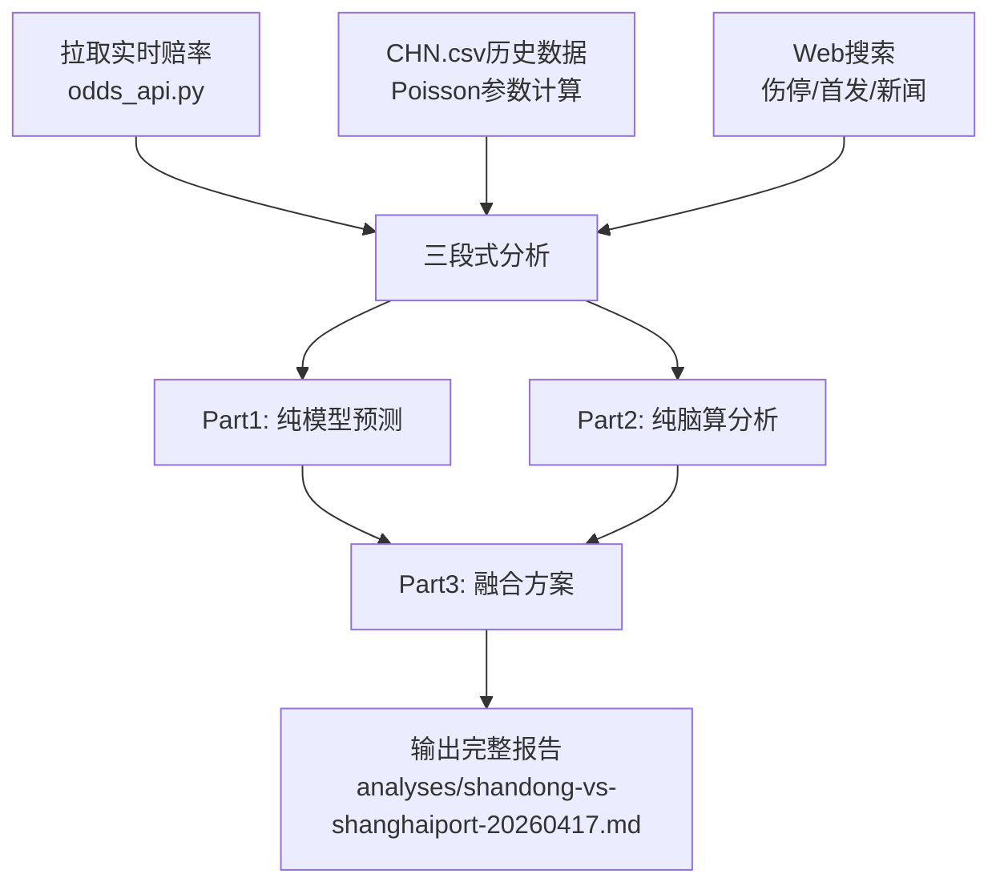

## 用户需求

分析今天（2026-04-17）中超山东泰山 vs 上海海港的比赛，输出完整的赛前投注分析报告

## 产品概述

基于项目已有的三段式赛前分析框架，对山东泰山vs上海海港的中超联赛进行赛前深度分析，覆盖模型预测、脑算补充、融合方案及所有必选模块

## 核心功能

- 拉取实时赔率（1X2/亚盘/大小球/BTTS/角球）
- 基于CHN.csv历史数据手动计算Poisson参数（无中超专属模型）
- Web搜索伤停/首发/近期新闻
- 按三段式模板输出完整分析到analyses目录
- 包含11大必选模块：纯模型、纯脑算、融合方案(含角球)、xG深度、命中矩阵、一致性检查、临场调整、同类对比、经验检查、角球专项、纯模型假设结算

## Tech Stack

- Python 3.11+: 数据处理与Poisson计算
- 赔率API: `scripts/odds_api.py`（The Odds API，支持中超）
- 数据源: `data/CHN.csv`（中超历史赛果+欧赔）、Web搜索（伤停/新闻）、api-football（中超阵容/stats）
- 分析模板: `config/analysis-template.md`
- 输出格式: Markdown（analyses目录）

## Implementation Approach

由于项目无中超专属模型（只有E0/SP1/I1/CL），需采用手动Poisson计算方式：

1. 从CHN.csv提取山东和海港的历史进球数据，计算攻防因子
2. 结合2026赛季5轮数据调整参数（赛季初数据量小，权重调低）
3. 手动构建比分概率矩阵，计算1X2/大小球/BTTS隐含概率
4. 模型权重45%/脑算55%（中超+赛季初双重降权）

### 关键技术决策

- **权重调整**: 中超默认50/50，但赛季仅5轮→调至45/55（模型/脑算），因为：(1)中超数据质量偏低 (2)5轮样本太小，模型λ不稳定 (3)脑算信息（伤停/战意/战术）相对更重要
- **Poisson参数来源**: 用CHN.csv近3季数据计算基础λ，再用2026赛季5轮数据做短期修正（权重：长期0.6/短期0.4）
- **中超特有修正**: 点球溢价+0.3球、中超主场+5%（三角实证）、阵型对攻度=大小球首要因子
- **赔率必须实拉**: 禁止脑补赔率，用odds_api.py拉取

## Implementation Notes

- 赔率API有月度额度限制(500 credits/月)，查询时用`--league 中超 --search "Shandong"`精准查询
- CHN.csv队名: 山东=Shandong Taishan, 海港=Shanghai Port, 注意历史曾用名Shandong Luneng/Shanghai SIPG
- 2026赛季仅5轮，λ计算需结合2024-2025赛季数据做平滑
- 角球是项目唯一持续正向信号，必须包含角球专项评估
- 临场调整清单需在赛前15-30分钟逐项确认

## Architecture Design

无代码架构变更，复用现有分析框架：



## Directory Structure

```
football-betting/
├── analyses/
│   └── shandong-vs-shanghaiport-20260417.md  # [NEW] 山东vs海港完整赛前分析报告
├── .workbuddy/
│   └── memory/
│       └── MEMORY.md  # [MODIFY] 追加本场分析记录到已完成分析表
```

## Skill

- **football-betting-analyst**: 核心分析技能，驱动三段式赛前分析流程，融合xG数据、盘口价值判断、凯利公式资金分配、角球专项评估等全部分析模块
- **Browser Automation**: 用于Web搜索伤停/首发/阵容/近期新闻等实时信息（山东泰山和上海海港的最新伤病、预测首发、赛前发布会信息）

## SubAgent

- **code-explorer**: 在CHN.csv中快速定位山东和海港的历史比赛数据，计算攻防因子和Poisson参数