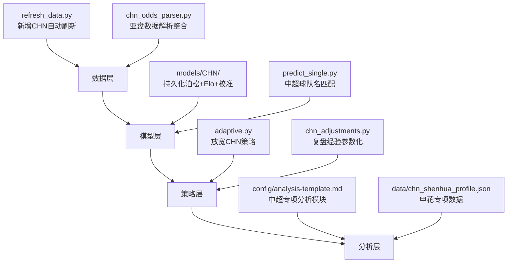

## 用户需求

提升中超联赛（特别是申花比赛）的投注 ROI 和胜率。

## 产品概述

当前中超投注基建严重落后于欧洲联赛：无预训练模型、无自动数据刷新、策略过于保守（仅投主胜且门槛65%）、缺少亚盘/大小球真实数据、球队名无模糊匹配、复盘经验未量化回流到模型参数。需要从数据采集、模型训练、策略扩展、申花专项四个维度系统性补齐短板。

## 核心功能

1. 中超数据自动刷新：将 CHN 加入 refresh_data.py 自动下载链路，并训练持久化模型到 models/CHN/
2. 中超预训练模型落地：训练泊松模型 + Elo + 校准器并持久化，预测时直接加载而非每次实时训练
3. 亚盘数据整合：将已有的 CHN_ah_2025_test.csv 亚盘数据解析整合进预测管道，提升大小球和让球判断精度
4. 自适应策略放宽：扩展中超投注市场从仅 home_win 到包含 draw、away_win、over_2_5，降低 min_prob 门槛至 0.55，启用校准器
5. 中超球队名模糊匹配：在 predict_single.py 的 aliases 字典中增加中超主要球队（申花、海港、国安、泰山等）的中英文映射
6. 复盘经验参数化回流：将中超点球溢价(+0.3球)、双433对攻大球修正、天气修正、德比角球修正等经验教训编码为可配置的中超专属修正参数
7. 申花专项数据积累：建立申花队历史对战、主客场、状态趋势的结构化分析数据，为申花比赛提供更精准的脑算输入

## 技术栈

- 语言：Python 3
- 核心依赖：pandas, numpy, scipy, scikit-learn (Isotonic 校准), xgboost
- 数据源：football-data.co.uk (CSV)、The Odds API、OddsHarvester (OddsPortal)
- 现有架构：泊松模型 + Elo 评分 + Isotonic 校准 + 1/4 Kelly 资金分配

## 实现方案

### 总体策略

从数据层、模型层、策略层、分析层四层逐步补齐中超基建短板，复用现有英超/西甲/意甲已验证的模型管道和代码模式，不引入新框架。

### 关键技术决策

1. **数据刷新**：football-data.co.uk 的中超 CSV URL 格式为 `https://www.football-data.co.uk/new/CHN.csv`（与欧洲联赛的 `mmz4281/2526/E0.csv` 路径不同），需要在 refresh_data.py 中增加特殊路径处理逻辑，而不是硬编码到 LEAGUE_URLS 字典中。

2. **模型持久化**：直接复用 predict_single.py 中已有的 `save_models()` / `load_models()` 函数，训练后保存到 `models/CHN/`，后续预测通过 `--model-dir models/CHN` 加载。

3. **亚盘数据整合**：CHN_ah_2025_test.csv 中亚盘数据是 JSON 格式嵌套多庄家赔率，需要写解析函数提取 bet365/Pinnacle 的最优赔率，转换为标准化格式后可合并到主 CSV 或作为独立补充数据源。考虑到格式差异大，采用独立模块解析而非强行合并到 CHN.csv。

4. **策略扩展**：当前 CHN 的 LeagueConfig 过于保守（仅 home_win, min_prob=0.65），根据 2 场复盘的核心教训——方向判断正确但进球类注单全错——应当：(a) 放宽市场到包含 draw 和 away_win（方向判断已验证可靠）；(b) 保持 over_2_5/under_2_5 但增加对攻度门控（双进攻阵型时禁止小球）；(c) 降低 min_prob 到 0.55 以捕获更多价值注。

5. **复盘经验编码**：在 src/ 下新建 `chn_adjustments.py` 模块，将散落在 MEMORY.md 中的定性经验转化为可调参数的修正函数（如 `penalty_premium()`, `weather_adjustment()`, `formation_attack_modifier()`），供分析脚本调用。

### 性能考量

- 中超 CHN.csv 有 2849 行数据，泊松模型训练耗时约 2-3 秒，持久化后加载 <100ms，性能提升 20-30 倍
- 校准器训练需要至少 200 场回测数据，CHN.csv 数据量充足（2849 场）
- 亚盘数据解析涉及 JSON 字符串 parse，52 行数据量极小无性能问题

## 实现注意事项

- CHN.csv 中早期赛季（2014-2015）缺少 Pinnacle/B365 赔率，校准器训练时需过滤无效行
- 球队名在 CSV 中为英文（如 "Shanghai Shenhua"），需同时支持中文别名匹配（"申花"、"上海申花"）
- `regression_factor=0.6` 仍有必要保持较低值，因为中超球队赛季间人员变动大（外援更替频繁）
- 数据刷新时 football-data.co.uk 的中超 URL 可能需要验证（`/new/CHN.csv` vs 其他格式），需在脚本中做 fallback 处理

## 架构设计



## 目录结构

```
project-root/
├── scripts/
│   ├── refresh_data.py          # [MODIFY] 新增 CHN 联赛自动下载和模型训练逻辑，处理 football-data.co.uk 中超 URL 格式差异，刷新后自动调用 retrain_model
│   └── predict_single.py        # [MODIFY] 在 _fuzzy_match 的 aliases 字典中增加中超球队中英文映射（申花/海港/国安/泰山/恒大等15+球队）
├── src/
│   ├── adaptive.py              # [MODIFY] 修改 CHN LeagueConfig：markets 扩展为 ["home_win","draw","away_win","over_2_5","under_2_5"]，min_prob 降至 0.55，启用 use_calibration=True
│   ├── chn_adjustments.py       # [NEW] 中超专属修正参数模块。将复盘经验编码为函数：penalty_premium(+0.3球)、weather_adjustment(阵雨-0.3~0.5球)、formation_attack_modifier(双433时大球+8%)、derby_btts_cap(历史BTTS权重上限10%)、goalkeeper_save_modifier(6+扑救时BTTS-10%)、early_season_discount(赛季前5轮模型权重降至40%)
│   └── chn_odds_parser.py       # [NEW] 亚盘数据解析模块。解析 CHN_ah_2025_test.csv 中 JSON 嵌套的多庄家亚盘赔率，提取 bet365/Pinnacle 最优赔率，输出标准化 DataFrame(match_date, home, away, ah_line, ah_home_odds, ah_away_odds, ou_line, over_odds, under_odds)，供 predict_single.py 和分析脚本调用
├── models/
│   └── CHN/                     # [NEW] 中超预训练模型目录。包含 poisson_params.json（攻防因子+联赛均值）、calibrator.pkl（Isotonic校准器）、elo_ratings.json（所有中超球队Elo评分）、meta.json（训练元数据）
├── data/
│   └── chn_shenhua_profile.json # [NEW] 申花专项数据档案。结构化记录：近3赛季逐场战绩、主客场胜率分布、核心球员出场统计、外援配置与伤停模式、德比历史交锋、盘口表现趋势、分阵型进球/失球数据、教练战术风格标签
└── config/
    └── analysis-template.md     # [MODIFY] 在中超权重指南区域新增中超专项修正清单（引用 chn_adjustments.py 中的参数），增加申花比赛专项分析模块（调取 chn_shenhua_profile.json 数据）
```

## 代理扩展

### Skill

- **football-betting-analyst**
- 用途：在申花专项数据积累和分析模板更新环节，利用该 skill 的足球分析方法论指导申花历史数据的结构化整理和分析模块设计
- 预期结果：输出符合赛前分析规范的申花专项数据档案和分析模板补充内容

### SubAgent

- **code-explorer**
- 用途：在实现各模块时探索现有代码模式（如 E0 模型的训练/保存/加载流程、odds_api.py 的赔率解析格式），确保中超模块与现有架构一致
- 预期结果：准确定位需要修改的代码位置和复用的函数签名