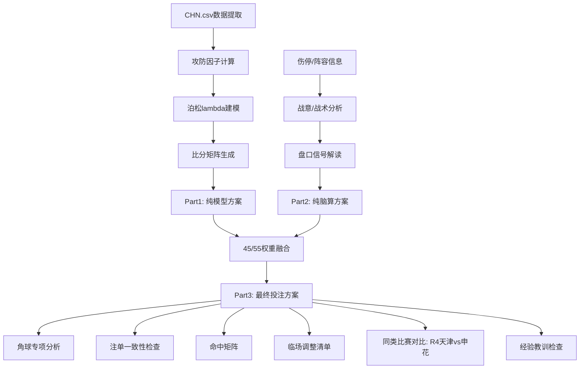

## 用户需求

对2026年4月18日晚20:00中超联赛第6轮 **上海申花(主) vs 辽宁铁人(客)** 的比赛进行完整的v5规范赛前分析。

## 产品概述

按照项目v5分析规范，生成一份结构化的三段式赛前投注分析报告，包含纯模型预测、纯脑算分析和融合投注方案，以及全部11个必选模块。

## 核心功能

1. **Part1 纯模型预测**: 基于CHN.csv历史数据手动计算泊松参数(攻防因子/lambda)，生成比分矩阵、1X2概率、大小球概率、亚盘概率、Kelly建议（中超无预训练模型，需手动建模，权重45%+脑算55%）
2. **Part2 纯脑算分析**: 阵容伤停双向评估（申花蒋圣龙+米内罗+吴启鹏三缺 vs 辽宁无伤停）、战意动力、战术匹配（申花4-2-3-1 vs 铁人阵型）、主客场因素、盘口信号解读
3. **Part3 融合方案**: 45/55权重融合、最终投注方案(bankroll=100元)、角球专项分析（盘口10.5 vs 预期11.4）、比分矩阵命中概率、注单一致性检查
4. **补充模块**: xG深度（中超有限数据修正）、命中矩阵、注单逻辑一致性、临场调整清单、同类比赛对比（天津vs申花R4作对标）、经验教训检查
5. **赔率验证**: 使用已实拉的Pinnacle/Bet365/1xBet等多家赔率（主胜1.37-1.43、亚盘-1.25、大小球3.0、角球10.5），禁止脑补赔率

### 关键分析变量

- 申花后防3人伤停(蒋圣龙/米内罗/吴启鹏) → xGA需上调+0.3~0.4
- 辽宁客场0W1D2L仅进1球 → 客场lambda需大幅下调
- 首次交锋 → H2H权重0%
- 角球市场: 申花7.2+辽宁4.2=11.4 vs 盘口10.5 → 潜在正EV
- 中超特殊修正: 点球溢价+0.3球、主场+5%、阵型对攻度=大小球首要因子

## 技术栈

- 数据源: `data/CHN.csv`（2014-2026中超历史数据，含Pinnacle/Bet365/Max/Avg赔率）
- 赔率来源: 已实拉的Pinnacle/1xBet/Bet365等13家博彩公司数据（OddsSafari/Scoremer）
- 分析模板: `config/analysis-template.md`（三段式v5规范）
- 输出文件: `analyses/shenhua-vs-liaoning-20260418.md`
- 参考分析: `analyses/shandong-vs-shanghaiport-20260417.md`（最近一场中超分析，同无专用模型）

## 实现方案

**手动泊松建模**: 中超没有预训练模型（models/目录仅有E0/SP1/I1），需基于CHN.csv中2025+2026赛季数据手动计算攻防因子和lambda参数。此方法已在山东vs海港分析中验证可行。

**权重分配**: 模型45% / 脑算55%（赛季初第6轮+无中超专属模型，参照前一场分析的权重设定）。

### 泊松参数计算方法

1. 从CHN.csv提取2025+2026赛季全部比赛，计算联赛场均进球（主队/客队）
2. 计算申花主场攻击因子（主场进球/联赛主场均进球）和防守因子（主场失球/联赛主场均失球）
3. 计算辽宁客场攻击因子和防守因子（注意：辽宁铁人仅有2026赛季3场客场数据，需特殊处理）
4. lambda计算: λ_home = 联赛场均主场进球 × 申花主场攻击因子 × 辽宁客场防守因子; λ_away同理
5. 中超特殊修正: 主场+5%、点球溢价+0.3球
6. 伤停修正: 申花xGA +0.3~0.4（蒋圣龙+吴启鹏双缺）

### 数据核实（CHN.csv验证）

**申花2026赛季5场**:

| 轮次 | 对手 | 比分 | 主客 |
| --- | --- | --- | --- |
| R1 | 大连英博 | 5-3 W | 主 |
| R2 | 浙江 | 1-1 D | 客 |
| R3 | 北京国安 | 1-1 D | 客 |
| R4 | 天津津门虎 | 2-3 W | 客 |
| R5 | 上海海港 | 1-0 W | 主 |


**辽宁铁人2026赛季5场**:

| 轮次 | 对手 | 比分 | 主客 |
| --- | --- | --- | --- |
| R1 | 山东泰山 | 0-3 L | 客 |
| R2 | 重庆铜梁龙 | 0-1 L | 客 |
| R3 | 天津津门虎 | 3-0 W | 主 |
| R4 | 北京国安 | 2-1 W | 主 |
| R5 | 青岛西海岸 | 1-1 D | 客 |


**辽宁客场数据极其关键**: 3场客场 0W1D2L，进1球失4球，场均进球仅0.33，客场攻击力几乎瘫痪。

### 实现注意事项

1. **辽宁铁人无2025赛季数据**（升班马，仅2026赛季5场），攻防因子样本极小（主场2场/客场3场），需加权处理或使用替代方法（升班马平均值+2026实际数据的混合因子）
2. **赔率已验证**: Pinnacle主胜1.40隐含概率约71.4%（去抽水后约68.5%），与申花实际强势表现匹配
3. **亚盘-1.25偏深**: 申花让球/球半=需赢2球才赢盘，考虑申花后防3人伤停+辽宁客场韧性（青岛1-1绝平），上盘存在压力
4. **角球盘10.5**: 申花场均角球7.2+辽宁4.2=合计11.4 > 盘口10.5，且申花主场攻击性强（射门16.2次/场），角球Over有价值
5. **中超点球溢价**: 中超裁判判罚标准宽松，场均点球高于五大联赛，需在lambda中+0.3球修正

## 架构设计

报告结构严格遵循`config/analysis-template.md`的v5三段式模板，参照`analyses/shandong-vs-shanghaiport-20260417.md`的中超分析格式:



## 目录结构

```
analyses/
└── shenhua-vs-liaoning-20260418.md  # [NEW] 申花vs辽宁铁人完整v5分析报告
                                      # 三段式结构: Part1纯模型(泊松/比分矩阵/EV/Kelly)
                                      # Part2纯脑算(伤停/战意/战术/盘口)
                                      # Part3融合(投注方案/角球专项/命中矩阵/一致性检查
                                      # /临场调整/同类对比/经验教训)
                                      # 权重: 模型45%+脑算55%
                                      # Bankroll: ¥100
```

## Agent Extensions

### Skill

- **football-betting-analyst**
- 用途: 作为核心分析引擎，执行完整的v5三段式赛前分析流程，包括泊松建模、EV计算、Kelly仓位、角球专项、比分矩阵、注单一致性检查等全部11个模块
- 预期结果: 生成一份结构化的 `analyses/shenhua-vs-liaoning-20260418.md` 分析报告，包含明确的投注方案(核心注/价值注/博冷注/角球注)和bankroll分配

### SubAgent

- **code-explorer**
- 用途: 在数据计算阶段，从CHN.csv中提取2025+2026赛季数据，计算联赛场均、申花主场攻防因子、辽宁客场攻防因子等关键参数
- 预期结果: 获取准确的泊松参数基础数据（联赛主场均进球、客场均进球、各队攻防因子）